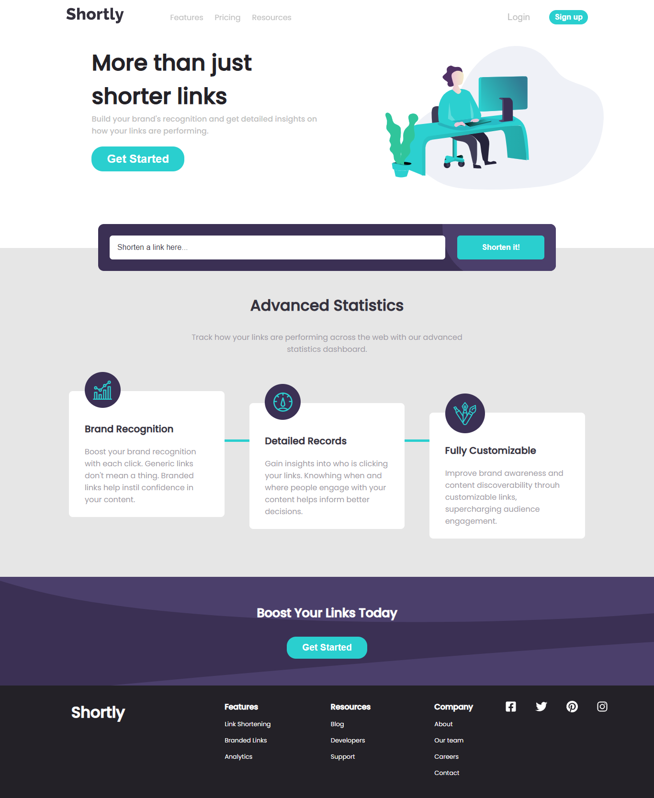

# Frontend Mentor - Shortly URL shortening API Challenge solution

This is a solution ito the [Shortly URL shortening API Challenge challenge on Frontend Mentor](https://www.frontendmentor.io/challenges/url-shortening-api-landing-page-2ce3ob-G). Frontend Mentor challenges help you improve your coding skills by building realistic projects.

## Table of Contents

- [Frontend Mentor - Shortly URL shortening API Challenge solution](#frontend-mentor---shortly-url-shortening-api-challenge-solution)
  - [Table of Contents](#table-of-contents)
  - [Overview](#overview)
    - [The challenge](#the-challenge)
    - [Screenshot](#screenshot)
    - [Links](#links)
  - [My Process](#my-process)
    - [Built With](#built-with)
    - [Continued Development](#continued-development)
  - [Author](#author)
  - [Acknowledgements](#acknowledgements)

## Overview

### The challenge

Users should be able to:

- View the optimal layout for the site depending on their device's screen size
- Shorten any valid URL
- See a list of their shortened links, even after refreshing the browser
- Copy the shortened link to their clipboard in a single click
- Receive an error message when the `form` is submitted if:
  - The `input` field is empty

### Screenshot

### Links

- Solution URL: [Solution URL](https://github.com/Multimarix/url-shortener-react-app)
- Live Site URL: [Shortly Site](https://shortly-reactapp.netlify.app/)

## My Process

### Built With

- Semantic HTML5 markup
- CSS custom properties
- Flexbox
- CSS Grid
- Mobile-first workflow
- [React](https://reactjs.org/) - JS library
- [Styled Components](https://styled-components.com/) - For styles
- [shrtcode API](https://app.shrtco.de/) - For the URL shortening

### Continued Development

I plan to continue developing and improving the error handling of the application and the user experience when it comes to using the form.

## Author

- Github - [Di-void](https://github.com/Di-void)
- Frontend Mentor - [@Multimarix](https://www.frontendmentor.io/profile/Multimarix)
- LinkedIN - [Don Akhirebhulu](https://www.linkedin.com/in/don-akhirebhulu-675082242/)

## Acknowledgements

Hats off to frontend mentor for bringing this project to work on.
